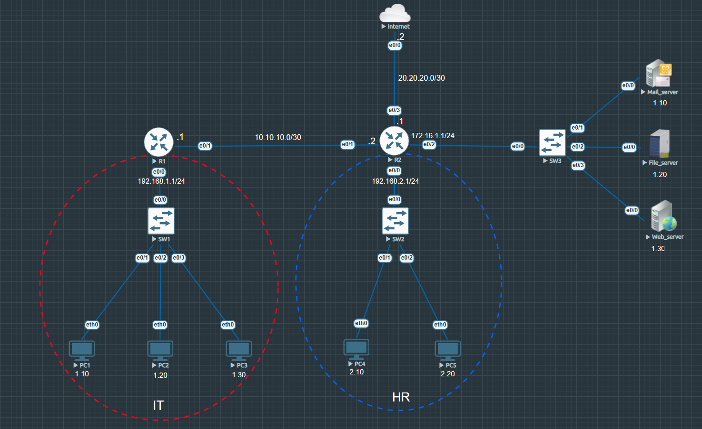

# Named ACL

### Summary

Objective of this lab is to configure, apply, and verify Named Access Control Lists (ACLs) to control network traffic. 

In this lab, Named Access Control Lists were implemented on the router infrastructure to enforce basic network traffic filtering and management security.

---

## Topology Architecture & Addressing Plan

---

### Network Environment Specifications
* **Simulation Environment:** EVE-NG Community Edition
* **Router Image Version:** Cisco IOL/IOU L3 Advanced Enterprise (L3-adventerprisek9-15.5.2T.bin)
* **Switch Image Version:** Cisco IOL/IOU L2 Advanced Enterprise (L2-ADVENTERPRISE-M-15.1-20140814.bin)

---

### IP Addressing Table

|Device   |Interface     |IP address   |Subnet Mask   |Default Gateway  |Description   |  
|:---:|:---:|:---:|:---:|:---:|---|
|R1   |Ethernet 0/0   |192.168.1.1   |255.255.255.0   |N/A   |IT LAN gateway   |
|   |Ethernet 0/1   |10.10.10.1   |255.25.255.252   |N/A   |WAN interface to R2   |
|R2   |Ethernet 0/0   |192.168.2.1   |255.255.255.0   |N/A   |HR LAN gateway   |
|   |Ethernet 0/1   |10.10.10.2   |255.25.255.252   |N/A   |WAN interface to R1   |
|   |Ethernet 0/2   |172.16.1.1   |255.25.255.0   |N/A   |Servers gateway   |
|   |Ethernet 0/3   |20.20.20.1   |255.255.255.252   |N/A   |ISP internal gateway  |
|Internet   |Ethernet 0/0   |20.20.20.2   |255.255.255.2   |N/A   |Link to R2   |
|Mail Server   |Ethernet 0/0    |172.16.1.10   |255.255.255.0   |172.16.1.1   |Mail server   |
|File Server   |Ethernet 0/0    |172.16.1.20   |255.255.255.0   |172.16.1.1   |File server   |
|Web Server   |Ethernet 0/0    |172.16.1.30   |255.255.255.0   |172.16.1.1   |Web server   |
|PC1   |Ethernet 0/0   |192.168.1.10   |255.255.255.0   |192.16.1.1   |IT host   |
|PC2   |Ethernet 0/0   |192.168.1.20   |255.255.255.0   |192.16.1.1   |IT host   |
|PC3   |Ethernet 0/0   |192.168.1.30   |255.255.255.0   |192.16.1.1   |IT host   |
|PC4   |Ethernet 0/0   |192.168.2.10   |255.255.255.0   |192.16.2.1   |HR host   |
|PC5   |Ethernet 0/0   |192.168.2.20   |255.255.255.0   |192.16.2.1   |HR host   |

---

### Routing summary table

|Device   |Protocol   |Network advertised  |Description   |
|:---:|:---:|:---:|---|
|R1   |OSPF (Area 0)   |192.168.1.0/24   |IT subnet   |
|   |OSPF (Area 0)   |10.10.10.0/30   |P2P WAN link to R2|
|   |OSPF (Area 0)   |1.1.1.1/32   |Loopback 0   |
|R2   |OSPF (Area 0)   |192.168.2.0/24   |HR subnet   |
|   |OSPF (Area 0)   |10.10.10.0/30   |P2P WAN link to R2 |
|   |OSPF (Area 0)   |172.16.1.0/24   |Server subnet   |
|  |OSPF (Area 0)   |2.2.2.2/32  |Loopback 0   |
|   |Static default route   |0.0.0.0   |default gateway to Internet   |

---

**Rule list:** [View rules](./configs/ACL_rules.txt)

**Configurations:** [View all configurations](./configs/Named%20ACL%20Configurations.txt)

**Verifications:** [View all verifications](./configs/Named%20ACL%20Verifications.txt)

---

Copyright © 2026 Sanuth Mawilmada. Licensed under the <a href="./LICENSE">MIT License</a>.
