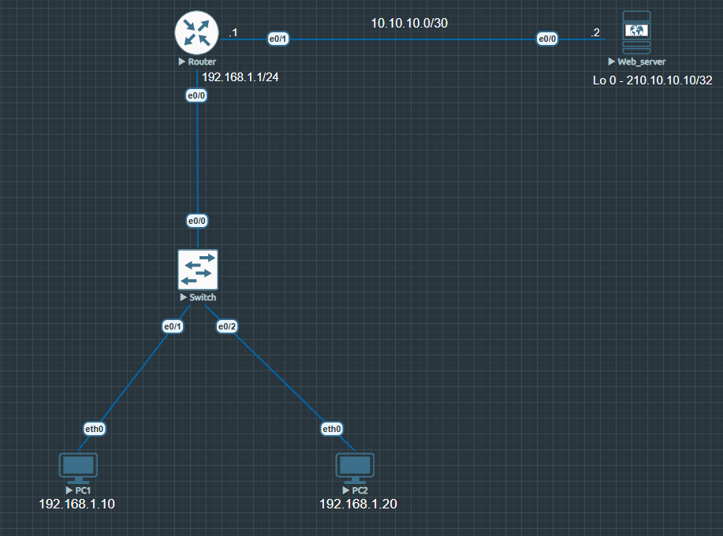

# Time Based ACL

### Summary

Objective of this lab is to configure, apply, and verify Time Based Access Control Lists (ACLs) to control network traffic. 

In this lab, a Time Based ACL is implemented on the router to enforce basic network traffic filtering and management security.

---

## Topology Architecture 

---

### Network Environment Specifications
* **Simulation Environment:** EVE-NG Community Edition
* **Router Image Version:** Cisco IOL/IOU L3 Advanced Enterprise (L3-adventerprisek9-15.5.2T.bin)
* **Switch Image Version:** Cisco IOL/IOU L2 Advanced Enterprise (L2-ADVENTERPRISE-M-15.1-20140814.bin)

---

### IP Addressing Table

|Device   |Interface     |IP address   |Subnet Mask   |Default Gateway  |Description   |  
|:---:|:---:|:---:|:---:|:---:|---|
|Router  |Ethernet 0/0   |192.168.1.1   |255.255.255.0   |N/A   |LAN gateway   |
|   |Ethernet 0/1   |10.10.10.1   |255.255.255.252   |N/A   |Server gateway  |
|Web_server  |Ethernet 0/0   |10.10.10.2   |255.255.255.252   |10.10.10.1  |WAN interface to Router  |
|   |Loopback 0   |210.10.10.10   |255.255.255.255   |10.10.10.1  |Loopback 0  |
|   |Loopback 1   |8.8.8.8  |255.255.255.255   |10.10.10.1   |Loopback 1  |
|PC1   |Ethernet 0/0   |192.168.1.10   |255.255.255.0   |192.168.1.1   |LAN host|
|PC2   |Ethernet 0/0   |192.168.1.20   |255.255.255.0   |192.168.1.1   |LAN host |

---

**Rule list:** [View rules](./configs/ACL_rules.txt)

**Configurations:** [View all configurations](./configs/Time%20Based%20ACL%20Configurations.txt)

**Verifications:** [View all verifications](./configs/Time%20Based%20ACL%20Verifications.txt)

---

Copyright © 2026 Sanuth Mawilmada. Licensed under the <a href="./LICENSE">MIT License</a>.
