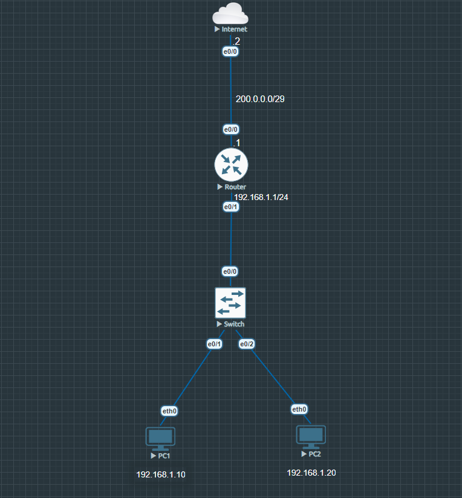

# Static NAT

### Summary 

* This lab include the implementation and verification of Static NAT (One-to-One Translation). 
* Static NAT permanently maps a specific Inside Local private IP address to a dedicated Inside Global public IP address.
* This method is primarily used for internal servers that require consistent external accessibility from the Internet.

---

## Topology Architecture

---

### Network Environment Specifications
* **Simulation Environment:** EVE-NG Community Edition
* **Router Image Version:** Cisco IOL/IOU L3 Advanced Enterprise (L3-adventerprisek9-15.5.2T.bin)
* **Switch Image Version:** Cisco IOL/IOU L2 Advanced Enterprise (L2-ADVENTERPRISE-M-15.1-20140814.bin)

---

### IP Addressing Table

| Device  | Interface  | IP Address  |Subnet Mask   |Default Gateway   |Description   |
|:---:|:---:|:---:|:---:|:---:|:---:|
|Router  |Ethernet 0/0   |200.0.0.1   |255.255.255.248   |N/A   |Interface to Internet   |
|   | Ethernet 0/1   |192.168.1.1   |255.255.255.0   |N/A   |LAN Subnet   |
|Internet   |Ethernet 0/0   |200.0.0.2   |255.255.255.248   |N/A   |Interface to Router   |
|PC1   |Ethernet 0/0   |192.168.1.10   |255.255.255.0    |192.168.1.1   |LAN host   |
|PC2   |Ethernet 0/0   |192.168.1.20   |255.255.255.0    |192.168.1.1   |LAN host   |

---

**Configurations:** [View all configurations](./configs/Static_NAT_configurations.txt)

**Verifications:** [View all verifications](./configs/Static_NAT_verifications.txt)

---

Copyright © 2026 Sanuth Mawilmada. Licensed under the <a href="./LICENSE">MIT License</a>.
