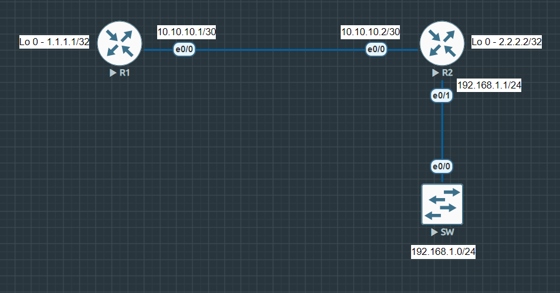

# OSPF_Core-Interface-Configurations

### Summary & Objective
This lab demonstrates the configuration and verification of a **Single-Area OSPF** routing topology using Cisco routers and a layer 2 switch. 
This lab focuses on fundamental OSPF concepts, including neighbor adjacencies, DR/BDR elections.

---

## Topology Architecture & Addressing Plan

---

### Network Environment Specifications:
* **Simulation Environment:** EVE-NG Community Edition
* **Router Image Version:** Cisco IOL/IOU L3 Advanced Enterprise (L3-adventerprisek9-15.5.2T.bin)
* **Switch Image Version:** Cisco IOL/IOU L2 Advanced Enterprise (L2-ADVENTERPRISE-M-15.1-20140814.bin)

### IP Addressing & Area Assignments Table:

|Device   |Interface   |IP Address   |Subnet Mask   |OSPF Area   |
|:---|:---|:---|:---|:--:|
| R1  |Ethernet 0/0   |10.10.10.1   |255.255.255.252   |0   |
|   |Loopback 0   |1.1.1.1   |255.255.255.255   |0   |
| R2  |Ethernet 0/0   |10.10.10.2   |255.255.255.252   |0   |
|   |Loopback 0   |2.2.2.2   |255.255.255.255   |0   |
|   |Ethernet 0/1   |192.168.1.1   |255.255.255.0   |0   |
|SW   |VLAN 1   |192.168.1.254   |255.255.255.0   |N/A   |

---

**Key Verifications**
1. **OSPF Adjacency:** Confirmed `FULL/DR` and `FULL/BDR` states using `show ip ospf neighbor`.
2. **Routing Table:** Verified OSPF routes using `show ip route ospf`.
3. **Passive Interface:** Confirmed suppressed Hello packets on the LAN using `show ip ospf interface ethernet 0/1`.
4. **Connectivity:** 100% ping success rate from switch SVI to R1 loopback interface.

---

**Device configurations:** [View all configurations](./configs/all-device-configs.txt)

**Verifications:** [View all verifications](./configs/verifications.txt)

---

Copyright © 2026 Sanuth Mawilmada. Licensed under the <a href="./LICENSE">MIT License</a>.
