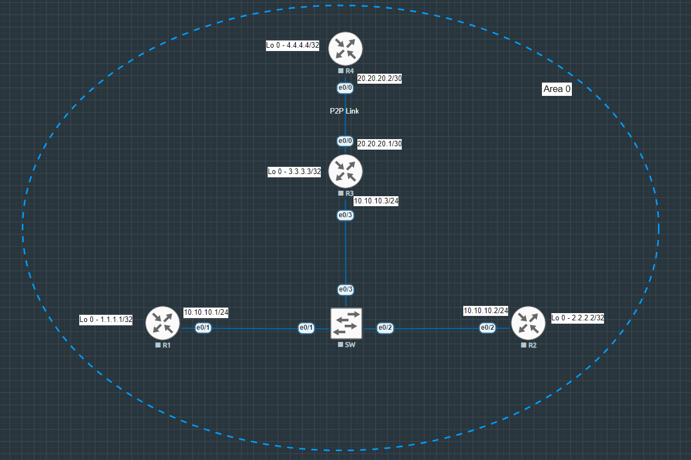

# OSPF_DR-BDR and P2P

### Summary & Objective
This lab shows the implementation, verification, and protocol analysis of Single-Area OSPF (Area 0) running across two distinct network types in a Cisco environment.
- **Broadcast Multi-Access Segment (LAN):** Connecting Routers R1, R2, and R3 via a Layer 2 Switch to analyze DR/BDR/DROTHER elections and Type 2 (Network) LSAs.
- **Point-to-Point (P2P) Link:** Connecting Routers R3 and R4 with the `ip ospf network point-to-point` configuration to bypass DR/BDR election overhead.

The objective is to establish 100% end-to-end IP reachability across Area 0 while verifying OSPF database mechanics, non-preemptive election behavior, and LSA structure.

---

## Topology Architecture & Addressing Plan

---

### Network Environment Specifications:
* **Simulation Environment:** EVE-NG Community Edition
* **Router Image Version:** Cisco IOL/IOU L3 Advanced Enterprise (L3-adventerprisek9-15.5.2T.bin)
* **Switch Image Version:** Cisco IOL/IOU L2 Advanced Enterprise (L2-ADVENTERPRISE-M-15.1-20140814.bin)

---

### IP Addressing & Area Assignments Table:

| Device  |Interface   |IP Address   |Subnet Mask   |OSPF Area   |Network Type  |Assigned OSPF Role   |
|:---|:---|:---|:---:|:---:|:---:|:---:|
| R1  |Ethernet 0/1  |10.10.10.1   |255.255.255.0   |0   |Broadcast  |DROTHER   | 
|   |Loopback 0   |1.1.1.1   |255.255.255.255   |0   |Loopback  |N/A (stub host)   |    
|R2   |Ethernet 0/2   |10.10.10.2   |255.255.255.0   |0   |Broadcast |BDR   |     
|   |Loopback 0   |2.2.2.2   |255.255.255.255   |0   |Loopback  |N/A (stub host)   |   
|R3   |Ethernet 0/3   |10.10.10.3   |255.255.255.0   |0   |Broadcast |DR   |
|   |Ethernet 0/0   |20.20.20.1   |255.255.255.0   |0   |Broadcast   |N/A (P2P)   |
|   |Loopback 0   |3.3.3.3   |255.255.255.255   |0   |Loopback  |N/A (stub host)   |
|R4   |Ethernet 0/0   |20.20.20.2   |255.255.255.0   |0   |Broadcast |N/A (P2P)   |
|   |Loopback 0   |4.4.4.4   |255.255.255.255   |0   |Loopback  |N/A (stub host)   |
|SW   |Ports e0/1-3   |Unmanaged   |N/A   |N/A   |N/A|N/A  |

---

## Key Verifications:

1. **OSPF Neighbor Adjacencies:**
  * Verified R3 as **DR** (`FULL/DR`) and R2 as **BDR** (`FULL/BDR`) on the Broadcast LAN segment.
  * Verified R3 ↔ R4 link state as **`FULL/ -`**, confirming DR/BDR election bypass on P2P links.

2. **Interface Network Types:**
  * Ethernet LAN interfaces verified as `Network Type BROADCAST`.
  * Inter-router P2P links verified as `Network Type POINT_TO_POINT`.

3. **OSPF Database Analysis:**
  * Verified Type 1 Router LSAs from all 4 routers in Area 0.
  * Verified Type 2 Network LSA generated exclusively by DR R3 (`10.10.10.3`).
  * Differentiated **Transit Networks** (LAN), **P2P Links**, and **Stub Networks** (Loopbacks) inside Type 1 LSA details.

4. **Routing Table:**
  * Confirmed all OSPF Intra-Area routes (`O`) learned across P2P and Broadcast domains.
  
5. **End-to-End Connectivity:**
  * Achieved 100% reachability across all Loopbacks.

---

**Device configurations:** [View all configurations](./configs/all-device-configs.txt)

**Verifications:** [View all verifications](./configs/verifications.txt)

---

Copyright © 2026 Sanuth Mawilmada. Licensed under the <a href="./LICENSE">MIT License</a>.

