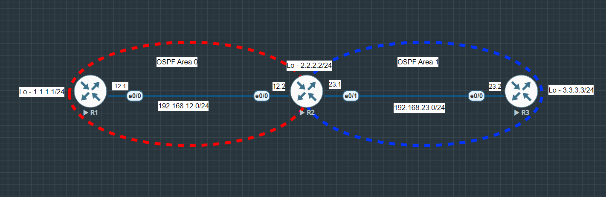

# OSPF LSA Types Analysis

### Summary & Objective
The primary objective of this lab is to design, deploy, and analyze a **Multi-Area OSPF** topology using Cisco IOS Routers simulated within an EVE-NG environment. 

This lab focuses on verifying OSPF neighbor adjacencies across backbone and non-backbone areas, and analysis of Link State Advertisements (**Type 1 Router LSA, Type 2 Network LSA, and Type 3 Summary LSA**) to understand OSPF database behavior across area boundaries.

---

## Topology Architecture & Addressing Plan

---

### Network Environment Specifications:
* **Simulation Environment:** EVE-NG Community Edition
* **Router Image Version:** Cisco IOL/IOU L3 Advanced Enterprise (L3-adventerprisek9-15.5.2T.bin)

### IP Addressing & Area Assignments Table:

| Device | Role | Interface | IP Address | Subnet Mask | Assigned OSPF Area |
| :---   | :--- | :---      | :---       | :---        | :---               |
| **R1** | Internal Backbone Router | Ethernet0/0 | `192.168.12.1` | `255.255.255.0` | **Area 0** (Backbone) |
| | | Loopback1 | `1.1.1.1` | `255.255.255.0` | **Area 0** (Backbone) |
| **R2** | Area Border Router (ABR) | Ethernet0/0 | `192.168.12.2` | `255.255.255.0` | **Area 0** (Backbone) |
| | | Ethernet0/1 | `192.168.23.1` | `255.255.255.0` | **Area 1** (Standard Area) |
| | | Loopback1 | `2.2.2.2` | `255.255.255.0` | **Area 0** (Backbone) |
| **R3** | Internal Standard Router | Ethernet0/1 | `192.168.23.2` | `255.255.255.0` | **Area 1** (Standard Area) |
| | | Loopback1 | `3.3.3.3` | `255.255.255.0` | **Area 1** (Standard Area) |

---

**Device configurations:** [View all configurations](./configs/all-device-configs.txt)

**Verifications:** [View all verifications](./configs/verifications.txt)

---

Copyright © 2026 Sanuth Mawilmada. Licensed under the <a href="./LICENSE">MIT License</a>.

