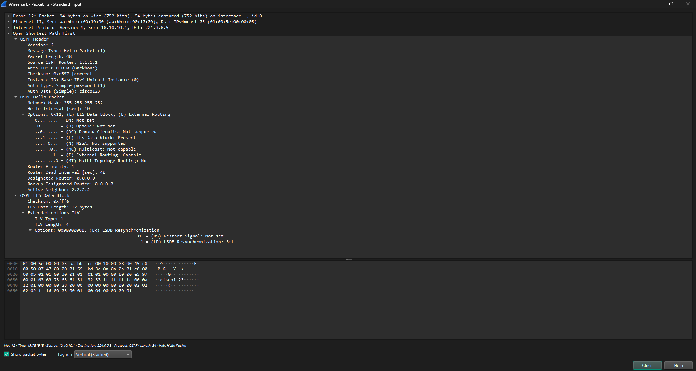
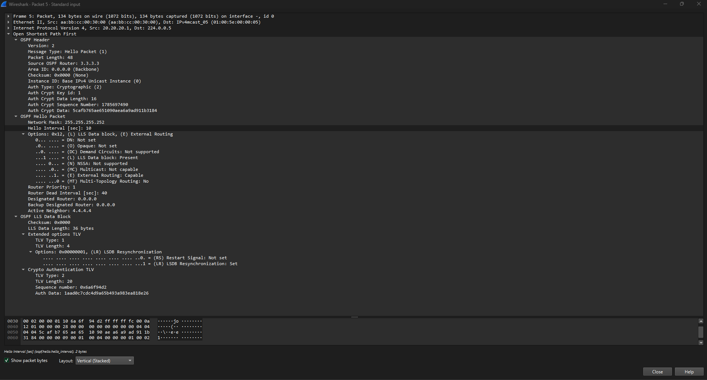

# OSPF_Plain text and MD5

---

### Summary & Objective
* This project demonstrates the configuration, verification, and security analysis of OSPFv2 authentication in an EVE-NG environment. 
* Configure OSPFv2 plaintext and MD5 authentication on Cisco IOS routers.
* Verify OSPF neighbor adjacencies and route exchanges.
* Perform troubleshooting using Cisco debug commands to observe key transitions and authentication failure states.
* OSPF control packets using wireshark to analyse difference between plain text and MD5.

---

## Topology Architecture & Addressing Plan

---

### Network Environment Specifications:
* **Simulation Environment:** EVE-NG Community Edition
* **Router Image Version:** Cisco IOL/IOU L3 Advanced Enterprise (L3-adventerprisek9-15.5.2T.bin)

---

### IP Addressing Table:

**Plain text**

| Device  |Interface   |IP Address   |Subnet Mask   |OSPF Area   |Authentication Type  |Key/Password   |
|:---|:---|:---|:---:|:---:|:---:|:---:|
| R1  |Ethernet 0/0  |10.10.10.1   |255.255.255.0   |0   |Plain text  |cisco123 |    
|R2   |Ethernet 0/0   |10.10.10.2   |255.255.255.0   |0   |Plain text |cisco123 |       

---

**MD5** 

| Device  |Interface   |IP Address   |Subnet Mask   |OSPF Area   |Authentication Type  |Key/Password   |
|:---|:---|:---|:---:|:---:|:---:|:---:|
|R3   |Ethernet 0/0   |20.20.20.1   |255.255.255.0   |0   |MD5 |Key ID 1:cisco123|
|R4   |Ethernet 0/0   |20.20.20.2   |255.255.255.0   |0   |MD5 |Key ID 1:cisco123|

---

## Key Verifications

**Active key validation:** Verified that OSPF MD5 is active on the interface and the router is utilizing Key ID 1 for signing outgoing packets.

**Dynamic key selection:** Confirmed via real-time debug logs that the router dynamically selects the newest active key (`Youngest Key 1`) to compute cryptographic hashes for OSPF traffic.

**Plaintext new key overwrite:** Observed that while Plaintext authentication immediately overwrites the existing key (risking neighbor drop). 

**MD5 multi-key coexistence:** MD5 allows multiple Key IDs to exist simultaneously on the same interface.

**Key removal error handling:** Observed that disabling Key ID 1 triggers a system warning error (`%OSPF-4-NOVALIDKEY`), indicating that no valid send key is available on the interface.

**Fallback to unauthenticated state:** Verified that removing the key forces the router into a `Key 0` (unauthenticated) state, leading to MD5 hashing failure and causing the OSPF neighbor adjacency to collapse.

**Automatic adjacency recovery:** Demonstrated that re-applying the valid Key ID 1 immediately restores packet signing (`Youngest Key 1`) and recovers the OSPF neighbor adjacency back to the `FULL` state.

**Zero-downtime key rollover:** Validated MD5's ability to support multiple concurrent keys on a single interface, enabling continuous password updates without causing network downtime.

---

**Plain text device configurations:** [View plain text device configurations](./configs/Plain%20text_configurations.txt)

**Plain text verifications:** [View plain text verifications](./configs/Plain%20text_configurations.txt)

**Plain text authentication mismatch analysis:** [View plain text authentication mismatch analysis](./configs/Plain%20text_authentication%20mismatch%20analysis.txt)

**MD5 device configurations:** [View MD5 device configurations](./configs/MD5_configurations.txt)

**MD5 verifications:** [View MD5 verifications](./configs/MD5_verifications.txt)

**MD5 authentication mismatch analysis:** [View MD5 authentication mismatch analysis](./configs/MD5_authentication%20mismatch%20analysis.txt)

---

### **Wireshark packet capture images**

**Wireshark_packet_capture_plaintext**

**Wireshark_packet_capture_MD5**

---

Copyright © 2026 Sanuth Mawilmada. Licensed under the <a href="./LICENSE">MIT License</a>.
