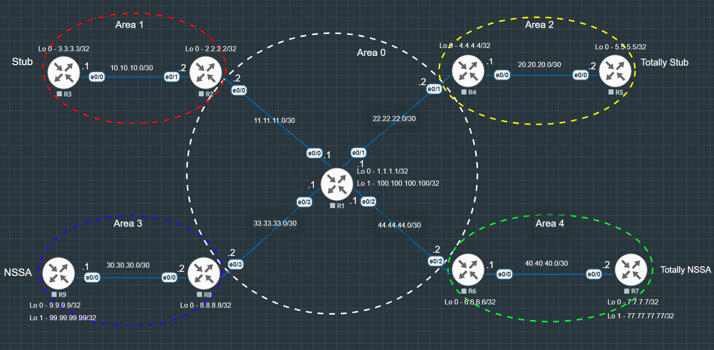

# OSPF Stub Areas

### Summary & Objective

* Objective is to design and analyze all four OSPF special area Types within a single consolidated topology.
* Configure a central Area 0 backbone with sub-areas (Area 1, 2, 3, and 4)
* Inject external routes from R1 (ASBR) using `redistribute connected` to generate Type 5 LSAs across Area 0.
* Implement **Area 1 (Stub Area)** to block Type 5 LSAs and verify automatic `O*IA` default route injection.
* Implement **Area 2 (Totally Stub Area)** using `no-summary` to block both Type 3 & Type 5 LSAs, leaving only a single `O*IA` default route.
* Implement **Area 3 (NSSA)** to block Type 5 LSAs while enabling local external route redistribution from R9 as Type 7 (`O N2`) LSAs.
* Implement **Area 4 (Totally NSSA)** using `no-summary` to strip inter-area routes while allowing local external redistribution from R7.

---

## Topology Architecture & Addressing Plan

---

### Network Environment Specifications
* **Simulation Environment:** EVE-NG Community Edition
* **Router Image Version:** Cisco IOL/IOU L3 Advanced Enterprise (L3-adventerprisek9-15.5.2T.bin)

---

### IP Addressing & Area Assignments Table

### Stub 

|Device |Interface   |IP Address   |Subnet Mask   |OSPF Area   |   
|:---:|---|---|---|:---:|
| R1  |Ethernet 0/0   |11.11.11.1   |255.255.255.252   |0   |
|   |Loopback 0  |1.1.1.1   |255.255.255.255   |0   |
|   |Ethernet 0/1   |22.22.22.1   |255.255.255.252   |0   |
|   |Ethernet 0/2   |44.44.44.1   |255.255.255.252   |0   |
|   |Ethernet 0/3   |33.33.33.1   |255.255.255.252   |0   |
|   |Loopback 1   |100.100.100.100   |255.255.255.255   |N/A   |
|R2   |Ethernet 0/0   |11.11.11.2   |255.255.255.252   |0   |
|   |Ethernet 0/1   |10.10.10.2   |255.255.255.252   |1   |
|   |Loopback 0   |2.2.2.2   |255.255.255.255   |0   |
|R3   |Ethernet 0/0   |10.10.10.1   |255.255.255.252   |1   |
|   |Loopback 0    |3.3.3.3   |255.255.255.255   |1   |
|R4   |Ethernet 0/1   |22.22.22.2   |255.255.255.252   |0   |
|   |Ethernet 0/0   |20.20.20.1   |255.255.255.252   |2   |
|   |Loopback 0   |4.4.4.4   |255.255.255.255   |0   |
|R5   |Ethernet 0/0   |20.20.20.2   |255.255.255.252   |2   |
|   |Loopback 0    |5.5.5.5   |255.255.255.255   |2   |
|R6   |Ethernet 0/2   |44.44.44.2   |255.255.255.252   |0   |
|   |Ethernet 0/0   |40.40.40.1   |255.255.255.252   |4   |
|   |Loopback 0   |6.6.6.6   |255.255.255.255   |0   |
|R7   |Ethernet 0/0   |40.40.40.2   |255.255.255.252   |4   |
|   |Loopback 0    |7.7.7.7   |255.255.255.255   |4  |
|   |Loopback 1   |77.77.77.77   |255.255.255.255   |N/A   |
|R8   |Ethernet 0/3   |33.33.33.2   |255.255.255.252   |0   |
|   |Ethernet 0/0   |30.30.30.2   |255.255.255.252   |3   |
|   |Loopback 0   |8.8.8.8   |255.255.255.255   |0   |
|R9   |Ethernet 0/0   |30.30.30.1   |255.255.255.252   |3   |
|   |Loopback 0    |9.9.9.9   |255.255.255.255   |3  |
|   |Loopback 1   |99.99.99.99   |255.255.255.255   |N/A   |

---

**Key Verifications**

* **Area 1 (Stub):**
  * Confirmed by `R3# show ip route ospf` to confirm external Type 5 routes (`100.100.100.100/32`) are blocked and replaced by an automatic default route (`O*IA 0.0.0.0/0`).
* **Area 2 (Totally Stub):**
  * Verified `R5# show ip route ospf` to ensure both Type 3 Inter-Area routes and Type 5 External routes are filtered, reducing the routing table to a single `O*IA 0.0.0.0/0` route via R4.
* **Area 3 (NSSA):**
  * Verified local redistribution on R9 (`99.99.99.99/32`) generates Type 7 LSAs (`O N2`) within Area 3, which are translated into Type 5 LSAs (`O E2`) by ABR R8 for propagation into Area 0.
* **Area 4 (Totally NSSA):**
  * Confirmed R7 receives an automatic default route (`O*IA` or `O*N2`) while blocking Inter-Area subnets, while successfully originating Type 7 external routes (`77.77.77.77/32`) back to Area 0 via R6.
* **End-to-End Connectivity:**
  * Issued `ping 1.1.1.1` from R3, R5, R7, and R9 to validate 100% data-plane reachability across the entire multi-area topology.

---

### Stub 
**Configurations:** [View Stub configurations](./configs/Stub/Stub_configurations.txt)
**Verifications:** [View Stub verifications](./configs/Stub/Stub_verifications.txt)

---

### Totally Stub 
**Configurations:** [View Totally Stub configurations](./configs/Totally%20Stub/Totally%20Stub_configurations.txt)
**Verifications:** [View Totally Stub verifications](./configs/Totally%20Stub/Totally%20Stub_verifications.txt)

---

### NSSA
**Configurations:** [View NSSA configurations](./configs/NSSA/NSSA_configurations.txt)
**Verifications:** [View NSSA verifications](./configs/NSSA/NSSA_verifications.txt)

---

### Totally NSSA 
**Configurations:** [View Totally NSSA configurations](./configs/Totally%20NSSA/Totally_NSSA_configurations.txt)
**Verifications:** [View Totally NSSA verifications](./configs/Totally%20NSSA/Totally_NSSA_verifications.txt)

---

Copyright © 2026 Sanuth Mawilmada. Licensed under the <a href="./LICENSE">MIT License</a>.
