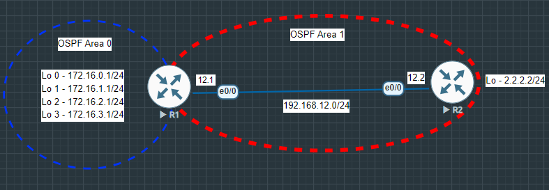

# OSPF Summarization

### Summary & Objective

* Configure OSPF route summarization on an Area Border Router (ABR) to reduce the routing table size and LSA flooding into adjacent areas.
* Configure OSPF multi-area topology.
* Advertise multiple contiguous `/24` loopback subnets (`172.16.0.0/24` to `172.16.3.0/24`) in area 0.
* Implement inter-area summarization at R1 (ABR) using a single `/22` summary route (`172.16.0.0 255.255.252.0`) into area 1.

* In this lab, **R1** acts as an **Area Border Router (ABR)** connecting **area 0** (Loopback interfaces) and **area 1**   (Inter-router link to R2). 

* Without summarization, R1 advertises four individual type 3 LSAs (`172.16.0.0/24`, `172.16.1.0/24`, `172.16.2.0/24`, and `172.16.3.0/24`) to R2. By executing the `area 0 range 172.16.0.0 255.255.252.0` command on R1, all four contiguous subnets are summerized into a single **`172.16.0.0/22`** summary route. 

* This optimization minimizes memory usage and CPU cycles on downstream routers (R2) and creates a local **`Discard Route (Null0)`** on R1 to prevent routing loops for unassigned IPs within the summary range.

---
## Topology Architecture & Addressing Plan

---

### Network Environment Specifications
* **Simulation Environment:** EVE-NG Community Edition
* **Router Image Version:** Cisco IOL/IOU L3 Advanced Enterprise (L3-adventerprisek9-15.5.2T.bin)

### IP Addressing & Area Assignments Table

|Device   |Interface   |IP Address   |Subnet Mask    |OSPF Area   |
|:---:|---|---|---|:---:|
| R1  | Ethernet 0/0  |192.168.12.1   |255.255.255.0   |0   |
|   |Loopback 0   |172.16.0.1   |255.255.255.0   |0   |
|   |Loopback 1   |172.16.1.1   |255.255.255.0   |0  |
|   |Loopback 2   |172.16.2.1   |255.255.255.0   |0   |
|   |Loopback 3   |172.16.3.1   |255.255.255.0   |0   |
|R2   |Ethernet 0/0   |192.168.12.2   |255.255.255.0   |1   |
|   |Loopback 0   |2.2.2.2   |255.255.255.0   |1   |  

---

**Key Verifications**

* Verify multiple contiguous `/24` loopback subnets (`172.16.0.0/24` to `172.16.3.0/24`) in area 0 before summarization.
* Analyse inter-area summarization at R1 (ABR) using a single `/22` summary route (`172.16.0.0 255.255.252.0`) into area 1 after summarization.
* Verify end-to-end reachability and routing table optimization on R2.

---

**Device configurations:** [View all configurations](./configs/All_Configurations.txt)

**Verifications before summarization:** [View verifications before summarization](./configs/Verifications%20before%20summarization.txt)

**Verifications after summarization:** [View verifications after summarization](./configs/Verifications%20after%20summarization.txt)

---

Copyright © 2026 Sanuth Mawilmada. Licensed under the <a href="./LICENSE">MIT License</a>.
