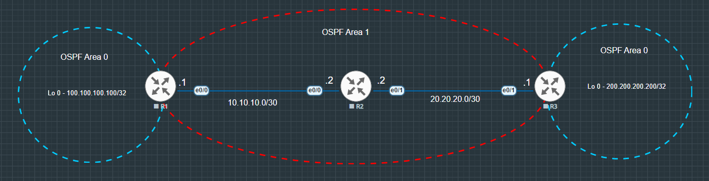

# OSPF Transit Area

### Summary & Objective

* Configure an OSPF Virtual Link across a transit area (Area 1) to connect two physically separated Area 0 segments
* Observe how Inter-Area summary LSAs (Type 3) and data packets pass through Area 1 to connect backbone routers (R1 and R3)
* Observe remote Area 0 loopback subnets appear as Intra-Area (`O`) routes rather than Inter-Area (`O IA`) once the Virtual Link is established.

---

## Topology Architecture & Addressing Plan

---

### Network Environment Specifications
* **Simulation Environment:** EVE-NG Community Edition
* **Router Image Version:** Cisco IOL/IOU L3 Advanced Enterprise (L3-adventerprisek9-15.5.2T.bin)

---

### IP Addressing & Area Assignments Table

|Device   |Interface   |IP Address   |Subnet Mask   |OSPF Area   |
|:---:|---|---|---|:---:|
|R1   |Ethernet 0/0   |10.10.10.1   |255.255.255.252   |1   |
|   |Loopback 0    |100.100.100.100   |255.255.255.255   |0   |
|R2   |Ethernet 0/0   |10.10.10.2   |255.255.255.252   |1   |
|   |Loopback 0    |2.2.2.2   |255.255.255.255   |1   |
|   |Ethernet 0/1   |20.20.20.2   |255.255.255.252   |1   |
|R3   |Ethernet 0/1   |20.20.20.1   |255.255.255.252   |1   |
|   |Loopback 0    |200.200.200.200   |255.255.255.255   |0   |

---

**Key Verifications**

* **Virtual Link Neighbor State:**
  * Executed `R1# show ip ospf virtual-links` and `R3# show ip ospf virtual-links` to verify that the adjacency status reached `FULL` over `OSPF_VL0`.
  * Verified that Router ID `100.100.100.100` (R1) and Router ID `200.200.200.200` (R3) successfully established the transit tunnel across Area 1.
* **Intra-Area Backbone Route:**
  * Checked `R3# show ip route ospf` to confirm that R1's Loopback 0 (`100.100.100.100/32`) appears as an **`O` (Intra-Area)** route instead of `O IA`, proving the logical restoration of the Area 0 backbone.
* **Data-Plane Connectivity:**
  * Tested end-to-end reachability via `R3# ping 100.100.100.100 source loopback 0` with a 100% success rate.
  
---

**Configurations:** [View Transit Area configurations](./configs/OSPF_Transit%20Area%20configurations.txt)

**Verifications:** [View Transit Area verifications](./configs/OSPF_Transit%20Area%20verifications.txt)

---

Copyright © 2026 Sanuth Mawilmada. Licensed under the <a href="./LICENSE">MIT License</a>.
