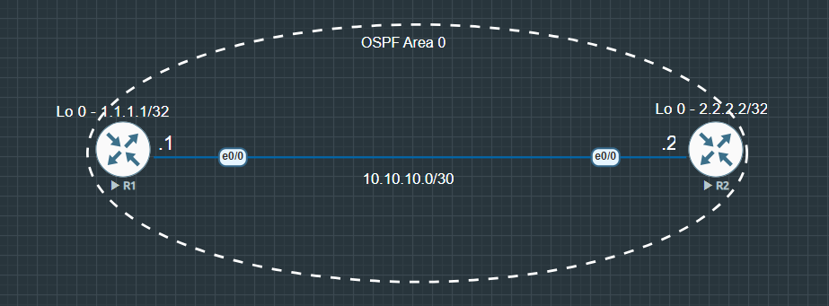

# OSPF V3

### Summary & Objective

* Configure and verify **OSPFv3 Address Family ** to route **IPv4 unicast traffic** using a modern, unified OSPFv3 process instead of traditional OSPFv2
* Traditional OSPFv2 only supports IPv4, while early OSPFv3 was strictly designed for IPv6
* OSPFv3 now enables dual-stack and single-engine routing for both IPv4 and IPv6 
* This lab walks through enabling OSPFv3 IPv4 capabilities, fulfilling control-plane prerequisites (IPv6 unicast routing and Link-Local addressing), and verifying full end-to-end connectivity

---

## Topology Architecture & Addressing Plan

---

### Network Environment Specifications
* **Simulation Environment:** EVE-NG Community Edition
* **Router Image Version:** Cisco IOL/IOU L3 Advanced Enterprise (L3-adventerprisek9-15.5.2T.bin)

---

### IP Addressing & Area Assignments Table

|Device   |Interface   |IP Address   |Subnet Mask   |OSPF Area   |
|:---:|---|---|---|:---:|
|R1   |Ethernet 0/0   |10.10.10.1   |255.255.255.252   |0   |
|   |Loopback 0   |1.1.1.1   |255.255.255.255   |0   |
|R2   |Ethernet 0/0   |10.10.10.2   |255.255.255.252   |0   |
|   |Loopback 0   |2.2.2.2   |255.255.255.255   |0   |

---

**Key Verifications**

* **OSPFv3 Neighbor Adjacency:**  
  Verify neighbor adjacency formation (**FULL/DR** or **FULL/BDR**) over IPv4 Address Family using:  
  `show ospfv3 ipv4 neighbor`

* **OSPFv3 Routing Information Base (RIB):**  
  Inspect routes learned specifically by OSPFv3 AF:  
  `show ospfv3 ipv4 rib`

* **IPv4 Routing Table:**  
  Confirm remote Loopback routes (`2.2.2.2/32` or `1.1.1.1/32`) exist in the global IPv4 routing table:  
  `show ip route ospf`

* **End-to-End ICMP Connectivity:**  
  Perform source-based ping tests between Loopbacks to ensure bidirectional reachability:  
  `ping 2.2.2.2 source loopback 0`

---

**Configurations:** [View OSPF_V3 configurations](./configs/OSPF%20V3%20configurations.txt)

**Verifications:** [View OSPF_V3 verifications](./configs/OSPF%20V3%20verifications.txt)

---

Copyright © 2026 Sanuth Mawilmada. Licensed under the <a href="./LICENSE">MIT License</a>.
