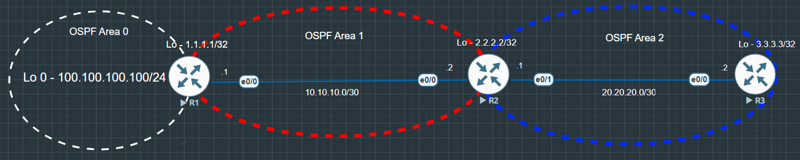

# OSPF Virtual Link

### Summary & Objective

* Main Objective is to design and validate an OSPF Virtual Link across a non-backbone transit area (Area 1) to restore full OSPF backbone reachability for a disconnected area (Area 2)
* Configure a multi-area OSPF network with Area 0, Area 1 (Transit Area), and Area 2 (Disconnected Non-Backbone Area)
* Demonstrate that Area 2 routers (R3) initially lack Area 0 Inter-Area routes due to the OSPF backbone connectivity rule
* Establish an OSPF Virtual Link between ABR R1 (Router ID `1.1.1.1`) and ABR R2 (Router ID `2.2.2.2`)
* Verify the virtual link adjacency state (`OSPF_VL0`) and validate full Inter-Area (`O IA`) routing table updates on R3
* Perform end-to-end ICMP reachability tests from Area 2 to Area 0s

---

## Topology Architecture & Addressing Plan

---

### Network Environment Specifications
* **Simulation Environment:** EVE-NG Community Edition
* **Router Image Version:** Cisco IOL/IOU L3 Advanced Enterprise (L3-adventerprisek9-15.5.2T.bin)

---

### IP Addressing & Area Assignments Table

| Device  |Interface   |IP Address   |Subnet Mask   |OSPF Area   |
|:---:|---|---|---|:---:|
|R1   |Ethernet 0/0   |10.10.10.1   |255.255.255.252   |1   |
|   |Loopback 0   |1.1.1.1   |255.255.255.255   |0   |
|   |Loopback 1   |100.100.100.100   |255.255.255.0   |0   |
|R2   |Ethernet 0/0   |10.10.10.2   |255.255.255.252   |1   |
|   |Ethernet 0/1   |20.20.20.1   |255.255.255.252   |2   |
|   |Loopback 0   |2.2.2.2   |255.255.255.255   |1   |
|R3   |Ethernet 0/0   |20.20.20.2   |255.255.255.252   |2   |
|   |Loopback 0   |3.3.3.3   |255.255.255.255   |2   |

---

**Key Verifications**

* **Virtual Link Neighbor Adjacency:**
  * Evaluated `R1# show ip ospf neighbor` to confirm the virtual link interface (`OSPF_VL0`) reached the `FULL/-` state with neighbor `2.2.2.2`.
  * Verified virtual link status using `show ip ospf virtual-links` to ensure transit parameters and cost calculations are correctly negotiated across Area 1.

* **Routing Table Optimization:**
  * Inspected `R3# show ip route ospf` to confirm successful learning of Area 0 subnets (`1.1.1.1/32`, `100.100.100.100/24`) and Area 1 subnets (`10.10.10.0/30`, `2.2.2.2/32`) as Inter-Area (`O IA`) routes.

* **Data-Plane Reachability:**
  * Issued `R3# ping 100.100.100.100 source loopback 0` to confirm 100% ICMP success rate across the newly established virtual link path.

---

**Configurations:** [View OSPF Virtual Link configurations](./configs/Virtual%20Link_configurations.txt)

**Verifications:** [View OSPF Virtual Link verifications](./configs/Virtual%20Link_verifications.txt)

---

Copyright © 2026 Sanuth Mawilmada. Licensed under the <a href="./LICENSE">MIT License</a>.
