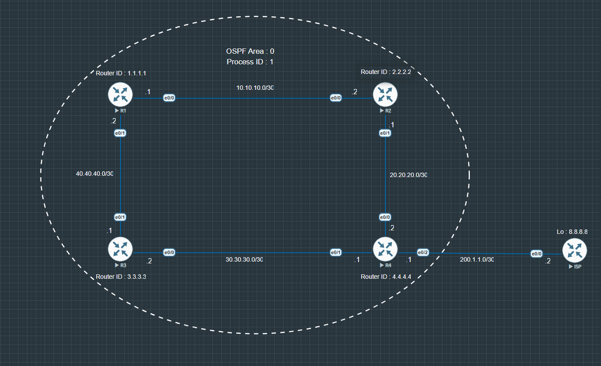

# OSPF topology 01

## Topology Architecture & Addressing Plan

---

### Network Environment Specifications
* **Simulation Environment:** EVE-NG Community Edition
* **Router Image Version:** Cisco IOL/IOU L3 Advanced Enterprise (L3-adventerprisek9-15.5.2T.bin)

---

### IP Addressing & Area Assignments Table

|Device   |Interface   |IP Address   |Subnet Mask   |OSPF Area   |
|:---:|---|---|---|:---:|
|R1   |Ethernet 0/0   |10.10.10.1   |255.255.255.252   |0   |
|   |Ethernet 0/1   |40.40.40.2   |255.255.255.252   |0   |
|   |Loopback 0    |1.1.1.1   |255.255.255.255   |0   |
|R2   |Ethernet 0/0   |10.10.10.2   |255.255.255.252   |0   |
|   |Ethernet 0/1   |20.20.20.1   |255.255.255.252   |0   |
|   |Loopback 0    |2.2.2.2   |255.255.255.255   |0   |
|R3   |Ethernet 0/1   |40.40.40.1   |255.255.255.252   |0   |
|   |Ethernet 0/0   |30.30.30.2   |255.255.255.252   |0   |
|   |Loopback 0    |3.3.3.3   |255.255.255.255   |0   |
|R4   |Ethernet 0/0   |20.20.20.2   |255.255.255.252   |0   |
|   |Ethernet 0/1   |30.30.30.2   |255.255.255.252   |0   |
|   |Ethernet 0/2   |200.1.1.1   |255.255.255.252   |0   |
|   |Loopback 0    |4.4.4.4  |255.255.255.255   |0   |
|ISP   |Ethernet 0/0   |200.1.1.2   |255.255.255.252   |N/A   |

---

**Configurations:** [View configurations](./configs/OSPF_topology_01_Configurations.txt)

**Verifications:** [View verifications](./configs/OSPF_topology_01_Verifications.txt)

---

Copyright © 2026 Sanuth Mawilmada. Licensed under the <a href="./LICENSE">MIT License</a>.
